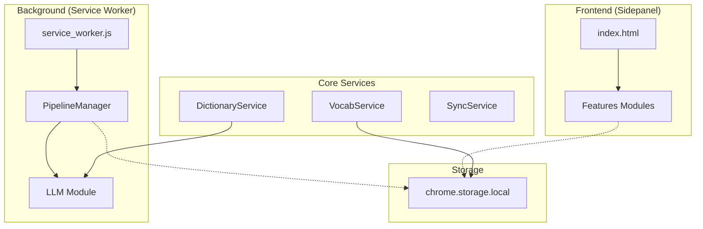

# 系统架构设计

## 架构概览

AIDU 采用典型的 Chrome Extension MV3 架构，分为后台服务 (Service Worker) 和前端 UI (Sidepanel) 两大部分，通过消息机制通信。



## 模块职责

### 1. Background Layer (`src/background/`)
负责长时运行的任务、LLM 调度和全局状态管理。

| 模块 | 文件 | 职责 |
|------|------|------|
| **Service Worker** | `service_worker.js` | 扩展入口，监听生命周期 |
| **Pipeline Manager** | `pipeline_manager.js` | 文章分析队列管理，并发控制 |
| **LLM Client** | `llm/api_client.js` | 统一的 LLM API 调用接口 |
| **Smart Router** | `llm/smart_router.js` | Prompt 构建与策略路由 |
| **Text Chunker** | `llm/text_chunker.js` | 文本分词与清洗 |

### 2. Sidepanel Layer (`src/sidepanel/`)
负责用户交互界面。

| 模块 | 路径 | 职责 |
|------|------|------|
| **Builder** | `features/builder/` | 文章输入与分析进度展示 |
| **Reader** | `features/reader/` | 交互式阅读与查词 |
| **Vocab** | `features/vocab/` | 生词列表与复习 |
| **Settings** | `features/settings/` | 用户偏好设置 |

### 2.1 Sidepanel Services (`src/sidepanel/services/`)
前端独有的业务逻辑。

| 服务 | 文件 | 职责 |
|------|------|------|
| **Draft** | `draft_service.js` | 草稿管理与存储 |

### 3. Service Layer (`src/services/`)
通用业务逻辑，可被 Background 或 Sidepanel 调用。

| 服务 | 文件 | 职责 |
|------|------|------|
| **Dictionary** | `dictionary_service.js` | 查词逻辑，缓存管理 |
| **Vocab** | `vocab_service.js` | 生词本增删改查 |
| **SRS** | `srs_algorithm.js` | 间隔重复算法 |
| **Sync** | `sync_service.js` | 多设备当前进度同步 |
| **Data** | `data_service.js` | 综合数据查询 |

### 4. Core & Utils (`src/core/`, `src/utils/`)
| 模块 | 文件 | 职责 |
|------|------|------|
| **Schema** | `core/schema.js` | 统一数据结构定义 |
| **Storage** | `utils/storage.js` | chrome.storage 封装 |
| **Router** | `utils/message_router.js` | 消息路由工具 |

## 文件目录结构
```
src/
├── background/         # 后台服务
│   ├── llm/            # LLM 相关
│   ├── pipeline_manager.js
│   └── service_worker.js
├── core/               # 核心定义
│   └── schema.js
├── services/           # 业务服务
│   ├── dictionary_service.js
│   ├── vocab_service.js
│   └── ...
├── sidepanel/          # 前端 UI
│   ├── features/       # 功能模块
│   ├── components/     # 通用组件
│   ├── services/       # 前端服务
│   │   └── draft_service.js
│   └── index.js
└── utils/              # 工具库
    ├── storage.js
    └── ...
```
